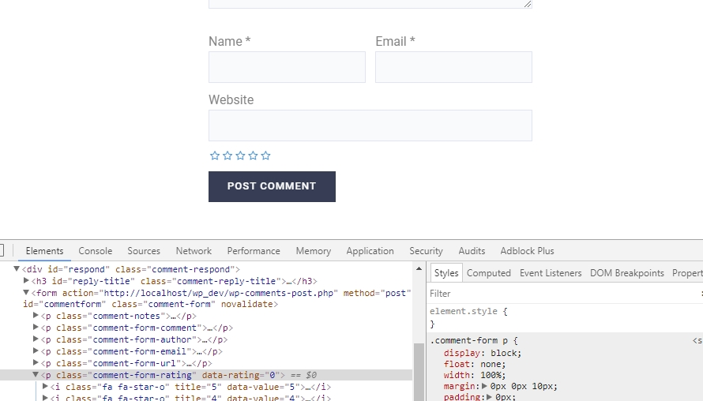
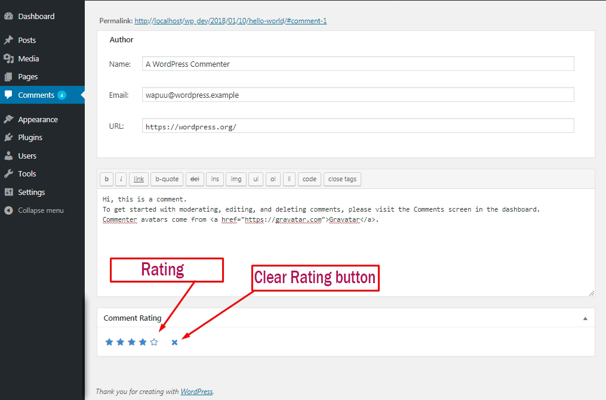
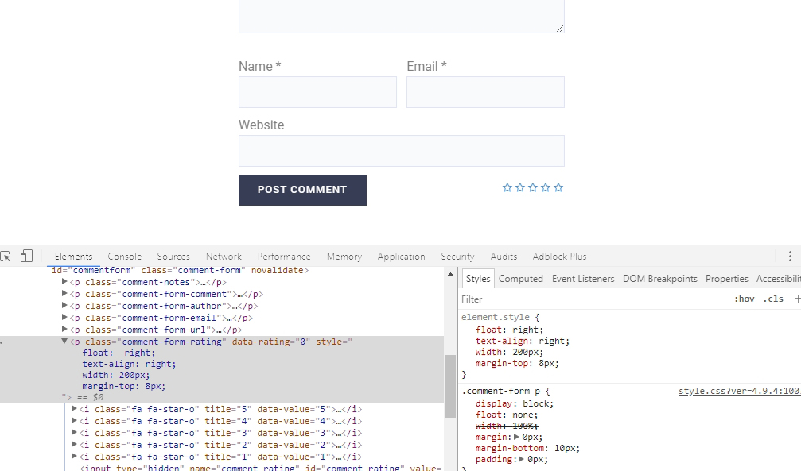

# wp-comment-rating

The easiest to use rating option in comment! [Comment Rating](http://www.rakibhossain.cf/comment-rating) plugin allows you to add a rating field in your comment from. Rating would be visible after comment content.

You can modify user comment rating by your dashboard comment screen.  

## Installation

Thank you for choosing Comment Rating! In order to use rating in comment from, simply activate the plugin. You may delete 'assets' folder :)

The field name, Comment Rating creates is 'field'.

 You can inspect element to change default style and style as you like
